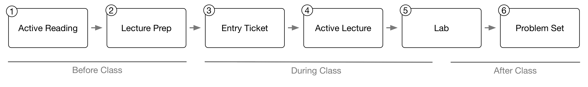

# (PART) First Steps {-}

# Approaching These Courses

Students have varying experiences learning computational techniques. For some, the math and programming that are the foundation for modern data science techniques come naturally. For others, being introduced to these concepts can be an anxiety producing experience. I am fond the phrase "your mileage will vary" for describing these differences - no two students have the exact same experience taking a computational methods course. Like the previous chapter, some of the content below is specific to the courses ([Introduction to Geographic Information Science (SOC 4650/5650)](https://slu-soc5650.github.io) and [Quantitative Analysis: Applied Inferential Statistics (SOC 4930/5050)](https://slu-soc5050.github.io)) I teach at [Saint Louis University](https://www.slu.edu), the general outlook on approaching data science work that I describe below is hopefully applicable in a far wider arena.

## Zen and the Art of Data Analysis
One of the biggest challenges with this course can be controlling the anxiety that comes along with learning new skills. `R` synatx, GIS terms, LaTeX commands, and Markdown can seem like foreign alphabets at first. Debugging `R` synatx can be both challenging and a large time suck, in part because you are not yet fluent with this language. Imagine trying to proofread a document written in a language that you only know in a cursory way but where you must find minute inconsistencies like misplaced commas.

For this reason, I also think it is worth reminding you that many students in the social sciences struggle with computational methods at first. It is normal to find this challenging and frustrating. I find that students who can recognize when they are beginning to go around in circles are often the most successful at managing the issues that will certainly arise during this course. Recognizing the signs that you are starting to spin your wheels and taking either ten minutes, an hour or two, or a day away from computational coursework is often a much better approach than trying to power through problems.

Data analysis therefore requires a certain mindfulness. I mentioned in the [Preface] that much of what this book covers are "habits of mind and habits of method". These mental habits extend past being able to recognize that frustration is setting in. They also include the mental habits needed for [Getting and Staying Organized] and strategies for [Getting Help] as you navigate the inevitable errors that come with learning new analytical skills.

## Getting and Staying Organized
Doing data science work, and having the space to step away for a day as the last section suggests, requires discipline and organization. Similarly, computational coursework can demanding not just because it is complex but because the courses often have a number of moving pieces that you need to keep track of. Being mindful of this challenege from the beginning, and taking steps to plan for it, is an important part of this course. 

### Keeping Track of Where You Are
Students who have some system for tracking their work and creating to-do lists are often the most successful in this course, not because they have a fundamentally better grasp on the content but because they simply are more organized. If you have never thought particularly hard about how you manage tasks, now is an excellent time to start doing so. You do not need fancy computer software to accomplish this, though there are an array of possibilities if you do want to use software to keep yourself organized. A legal pad or a notebook can be just as effective as a $50 to-do list manager. The point is, do *something*!

I am fond of recommending the [**Getting Things Done**](http://gettingthingsdone.com) methodology to students as part of thinking more wholistically about staying organized. The website [Lifehacker](https://lifehacker.com) posted an [excellent introduction to GTD](https://lifehacker.com/productivity-101-a-primer-to-the-getting-things-done-1551880955) that is a great way to get a sense of how it works and find additional resources for implementing it. 

The GTD website has a [great list of software](http://gettingthingsdone.com/common-tools-software/) for those of you looking for a to-do list application. One that isn't listed that I use for collaborating with my student research team is [Trello](https://trello.com), a freemium website that allows you to create simple to-do lists. It isn't sophisticated enough for implementing GTD, but it is more than sufficient for managing to-do lists related to this course.

### Managing Course Materials
For both courses covered by this book, materials will be disseminated in physical and digitial form. The topic of keeping digitial materials organized is the subject of the next chapter. The physical handouts and materials that we'll give out will all come three hole punched, and you are expected to purchase a three-ring binder for this course. I give out enough handouts that, without a binder, it becomes difficult to keep track of where handouts are located. I have watched students spend more time looking for the handout than it takes to find the answer to their question once they have the handout itself.

There are two recommended ways to keep your binder tidy. One is to organize by lecture. There are sixteen lectures worth of handouts in both courses (not including the course preview and the final research conference session), so two sets of dividers (which often come in packs of eight) should be sufficient. The other way to organize handouts is by topic. We hand out a number of different types of documents that could be organized thematically like so:

1. Syllabus and reading list
2. Workflow diagrams
3. `R` function sheets
4. ArcGIS process sheets (SOC 4650/5650 only)
5. LaTeX command sheets (SOC 4930/5050 only)
6. Sample outputs
7. Exercise handouts
8. Lab handouts
9. Problem set handouts

Since there are approximately eight different types of handouts in each class, a single package of dividers should be sufficient.

I don't think that one way of organization, thematically or temporally, is inherently better or worse than the other. In large part it comes down to how *you* like to organize information. After all, learning how to process and organize information in a way that works for you is the most important takeaway here.

## Course Flow

Both [Quantitative Analysis](https://slu-soc5050.github.io) and [Introduction to GIS](https://slu-soc5650.github.io) follow the same weekly flow or progression. The structure of the assignments and course materials presupposes that you adhere to this progression.

### Reading with Purpose
The book and article **reading assignments** for this course are different from most of the other reading you will do in your graduate program because they are often very technical. Students who are most successful in this course read twice. Read the first time to expose yourself to the material, then take a break from the reading. During this first read, I don’t recommend trying to complete the example problems or programming examples. Focus on the *big picture* - what are the concepts and ideas that these readings introduce?

During the second read, try to focus in in the *details* - what are the technical details behind the big picture concepts? I recommend doing this second read with your computer open. Follow along with the examples and execute as much of them as you can. By using this second read through as a way to test the waters and experiment with the week’s content, you can come into the lecture better prepared to take full advantage of the class period. Students who follow this approach are able make important connections and focus on the essential details during lectures because it is their third time being exposed to the course material. They are also in a much stronger position to ask questions.

### Lecture Preps
Once you've completed the readings for the week, tackle the **lecture prep**. These short assignments are designed to help prepare you for the upcoming lecture by reviewing some of the concepts from the reading. For many of the preps, I will post replication videos on YouTube that show how to solve each problem and provide some explanation for that process. Use this as an early indication of how well you understood the readings and what questions you might have. Bringing these questions to class is a great way to build your knowledge of the course material.

### Active Lectures and Labs
During **lectures**, I introduce many of the same topics that your readings cover. This again is intentional - it gives you yet another exposure to concepts and techniques that are central to geospatial science. One mistake students sometimes make is focusing on the details of *how* to do a particular task rather than focusing on *when* a task should be done. If you know when a task is needed but cannot remember how to do it in `R`, you can look this information up. Conversely, detailed notes on executing `R` commands may not be helpful if you are unsure when to use a particular skill. There is no penalty in this course for not knowing how to execute a command from memory; this is what reference materials are for. The most successful students will therefore focus on *when* a particular skill is warranted first before focusing on *how* to execute that skill

Getting experience with executing tasks is the purpose of the **lab exercises**. These are narrlowly defined and focused on building your confidence with the specific skills introduced each week. Time for beginning these exercises is given at the end of each class meeting, and replication files will be posted on GitHub for each lab. I suggest that students do not look at replication files until they are truly stumped. Spend some time wrestling with problems and code, and experiment with the trouble shooting process, when the stakes are low and you have a saftey-net to catch you. This will prepare you to respond to issues on the problem sets in a more resiliant way.

### Problem Sets
The problem sets are the key evaluation of your progress in the course. These will cover skills both for the week they are assigned as well as previous weeks to ensure that you are connecting various aspects of the course and are able to transition skills from one week to the next. Replication files will be provided after all problem sets are submitted and grades are returned. Review these replication files regardless of how well you do on a given problem set - there is much to learn from reviewing your progress and seeing a different approach to these assignments.

### An Apple a Day
As I noted above, some degree of frustration with these courses is to be expected - funtions in `R` will not work as intended, for example, and the ambiguity of error messages can be excruicating. I suggested above that you build into your approach to the course time to walk away from assignments if you hit a wall. Being able to walk away from an assignment for a day requires excellent time management. If you are waiting until the night before or the day of an assignment’s due day to begin it, you give yourself little room for errors. 

I recommend approaching this course in bite size chunks - a little each day. The most successful students do not do all of their reading, homework, and studying in a single sitting. I find that this approach not only creates unnecessary anxiety around assignments, it also dramatically limits the amount of course material you can absorb. Keep in mind that I expect the *median* student to spend approximately six hours on work for this class each week (twice the amount of in-class time). A sample approach to the class might look something like this:

  - Monday: class
  - Tuesday: finish lab
  - Wednesday: Start problem set
  - Thursday: Finish problem set
  - Friday: First reading
  - Saturday: Second reading
  - Sunday: Lecture prep for next class

The single biggest failure point in both courses for students is thinking that the few hours before class are sufficient for doing *all* of the work required for a particular week. It is the rare student who can do this successfully (not only in terms of meeting the required deadlines but also in terms of actually learning the material). Err on the side of giving yourself too much time to complete work rather than just enough!

## Staying Current
Course content is maintained both on the respective course websites ([Quantitative Analysis](https://slu-soc5050.github.io) and [GIS](https://slu-soc5650.github.io)) and GitHub organizations ([Quantitative Analysis](https://github.com/slu-soc5050) and [GIS](https://github.com/slu-soc5650)). Course materials are available throughout the semester and after the course is done. This creates two challenges. First, for all students, attention must be paid to when updates are pushed to GitHub and the course website. This is particularly true for content updated *after* a lecture. Second, for students who like to work ahead, care must be taken to ensure that you are working off of materials for the current semester and not the last semester the course was taught. 

There are two ways in which I help communicate the status of course content. First, I use badges on both the GitHub `README.md` files in individual lecture repositories and on individual lecture webpages to signal which semester the content is current for and what stage of development the content is in. These badges are used not just because they are effective but as part of a more general socialization into data science software development, where badges are used to signal development status on `R` package GitHub repositories (see, for example, [`ggplot2`](https://github.com/tidyverse/ggplot2)). 

Badges that indicate the semester that the content is current for are blue and look like this:

Badges that indicate the development status of content are either red, orange, or green. Here are the badges and their meaning:

 - only the Lecture Prep has been updated from previous semester

 - some content updates from previous semester are in draft form

 - lecture content has been updated but problem set has not been updated from previous semester

 - all content has been updated from the previous semester

 - additional updates have been made to this semester's content

