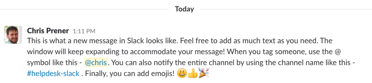
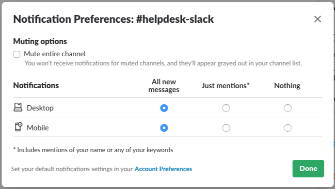
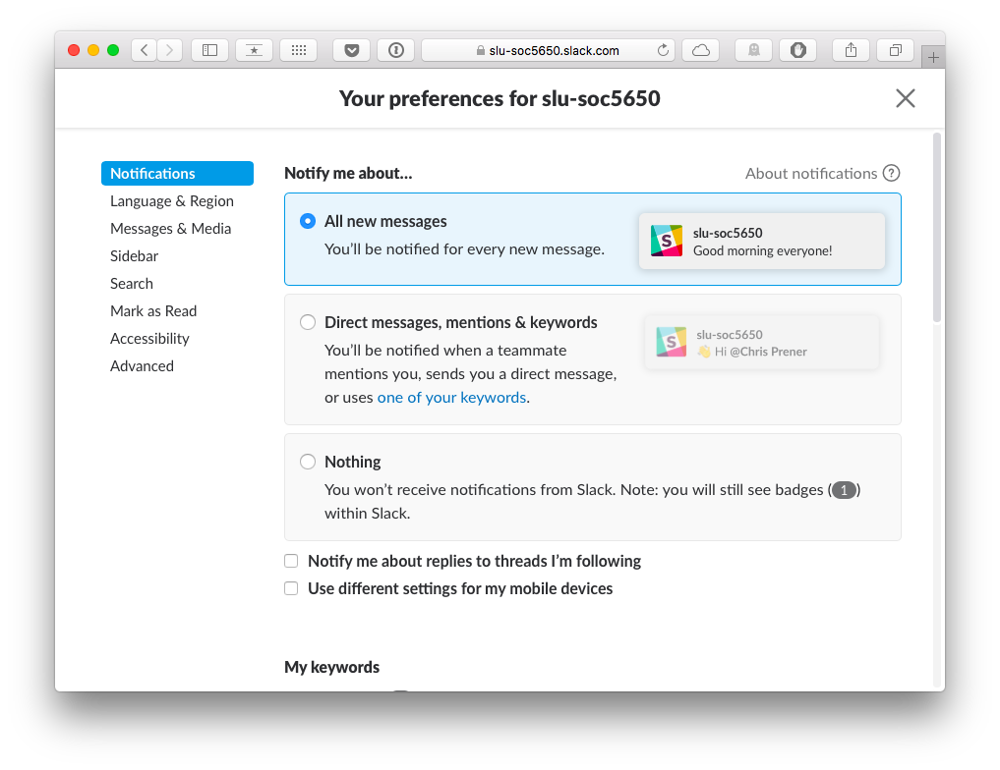
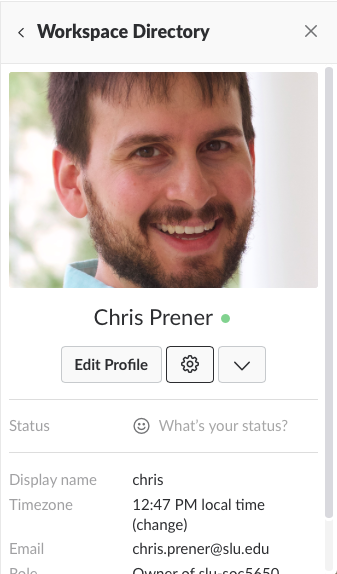
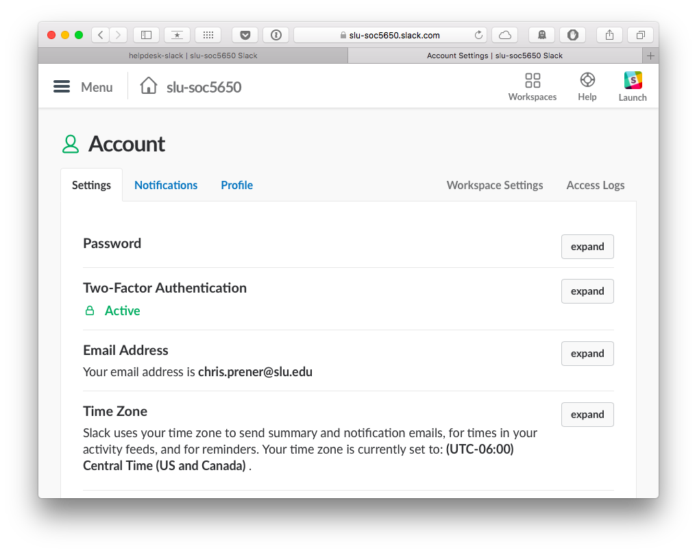
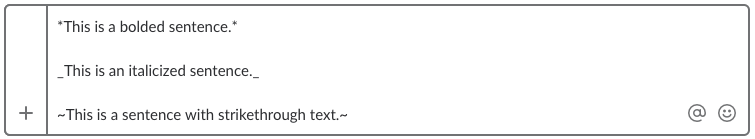
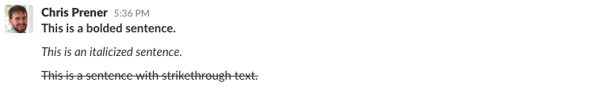
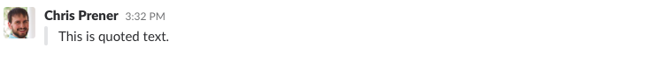
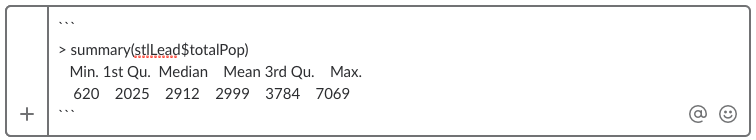

# Slack

One of the three core areas for analysis development identified by Parker (2017) is collaboration. Data science work often occurs in teams, sometimes remotely, and building a skillset in working collaboratively from the outset is important. This chapter will not focus on the soft skills required for working as part of a team. Rather, we'll focus on some of the technical tools that are useful for facilitating this work. One of the more common tools used today in data science, research, software development, and other technical settings is the service [Slack](https://slack.com). At its core, Slack is a messaging tool designed to keep people in touch with one another.

## Slack Basics
Slack is organized into **workspaces**, which are dedicated organizations that are independent from each other. This means that you have individual login credentials (username and password) for each Slack workspace. The image below is of a Slack workspace for [Introduction to Geographic Information Science (SOC 4650/5650)](https://slu-soc5650.github.io). We will discuss some of the individual elements of this image below.

```{r echo=FALSE, fig.align="center", out.width = '95%'}
knitr::include_graphics("images/slackOverview.png")
```

### Channels
**Channels** are found on the lefthand sidebar of a Slack **workspace**. Channels with a `#` sign are public, and those with a lock symbol are private. Slack workspaces are typically organized around channels that are dedicated to a specific topic or project. For the courses that I teach, there are dedicated helpdesk channels for some of the various tools that the course introduces as well as for coursework and assignments. For example, the `#helpdesk-slack` channel is open in the image above. Messages from individual users or updates appear in the main window. You can see messages from myself and another user in the image above.

To post a new message, use the field at the bottom of the main window that contains the placeholder text (visible in the image) "Message #helpdesk-slack". Click on the field and begin typing your message. You can click on the `@` icon to tag individuals using their user names, or use the channel's name - `#helpdesk-slack` - to notify all users. The smily face icon allows you to use emojis in your message. Messages can be composed using a flavor of Markdown (see the next section [Markdown in Slack]). Emojis will appear as text in a new message like `:smiley:` after they are selected. A newly composed message looks like this:

```{r echo=FALSE, fig.align="center", out.width = '95%'}
knitr::include_graphics("images/slackMessage.png")
```

To send a message, use the `Enter` or `Return` key. Once sent, that message will render so that it looks like this:

```{r echo=FALSE, fig.align="center", out.width = '95%'}

```

### Channel Preferences
You can search a channel (helpful if you are looking for information about a specific topic or issue) using the search field in the menu bar along the top of the main window. Information and preferences for individual channels can be accessed by clicking on the info icon along the top of the main window. For instance, I will sometimes "pin" posts so that they can be accessed later. You can see a list of pinned items by pulling down the Pinned Items menu.

These preferences include the ability to adjust the notifications for both desktop and mobile on a channel by channel basis. To adjust notifications for a channel:

1. Open the Channel Preferences
2. Pull down the Notification Preferences menu, where you will see an overview of your current desktop and mobile notification preferences
3. Click on `Edit preferences`
4. Make changes as desired in the Notification Preferences window

The Notification Preferences window for the `#helpdesk-slack` channel looks like this:

```{r echo=FALSE, fig.align="center", out.width = '95%'}

```

If you do not want to set notifications on a channel by channel basis, you can set workspace-wide notification preferences by following the `Account Preferences` link in this window (see [Preferences] below). I do warn students, however, that Slack is our primary means of communication and muting or reducing notifications puts more of an onus on students to mindfully check-in on channel activity on a regular basis.

### Direct Messages
Direct messages are messages can be accessed only by the participants. Direct message channels are useful for reaching out directly to other individuals to have private conversations. You can start a new direct message by clicking on the plus icon to the right of the Direct Messages heading (see the first image in this chapter). Messages are authored using the same means as in public and private channels (see [Channels] above as well as [Markdown in Slack]). 

I ask that questions about Problem Sets that are specific be addressed as direct messages first. For all other questions, I encourage students to use the public channels so that we can learn collectively from each other's experiences. If you are not sure whether or not a question is appropriate for a public channel or would prefer to not ask the question publicly, feel free to use a direct message!

### Preferences
The Preferences window can be used to adjust settings that control your Slack workspace. These include how your sidebar is organized, how "mark as read" functions, and how notifications for all channels work by default. You can access the Preferences from the main menu, which is available by clicking on the workspace name:

```{r echo=FALSE, fig.align="center", out.width = '95%'}
knitr::include_graphics("images/slackMenu.png")
```

The Notifications tab can be used to set global defaults for notifications:

```{r echo=FALSE, fig.align="center", out.width = '95%'}

```

You can use this window to create additional notifications for when specific keywords appear. For example, if you wanted to be notified if any mentions of the `ggplot2` package appear in a Slack channel, you could add "ggplot2" as a keyword. This window also allows you to adjust your do not disturb settings and the sounds that are played when new messages are posted while you are online.

### Profile
Profile settings, like your name, display name, timezone, and other items can be edited as well. You can access them by selecting Profile & Account from the main menu, which is available by clicking on the workspace name:

```{r echo=FALSE, fig.align="center", out.width = '95%'}
knitr::include_graphics("images/slackProfileMenu.png")
```

This will open a sidebar on the right side of your screen that looks something like this:

```{r echo=FALSE, fig.align="center", out.width = '40%'}

```

If you select Edit Profile, you can change your full name and display name, adjust your timezone, and optionally add other details as well. There is no need to add phone numbers or Skype handles for course workspaces. You can also change your profile picture here. The window will look like this:

```{r echo=FALSE, fig.align="center", out.width = '95%'}
knitr::include_graphics("images/slackProfileEdit.png")
```

Make sure you hit Save Changes when you are done!

To make more fine-grained changes to your account for this Slack workspace, click on the wheel icon in the sidebar that opens after selecting Profile & Account from the main menu. The wheel icon is next to the Edit Profile button. Clicking the wheel icon will open a new tab in your browser:

```{r echo=FALSE, fig.align="center", out.width = '95%'}

```

Many of the changes that can be made in other places can also be made here. Additionally, you can adjust Two-Factor Authentication security settings here as well.

### Getting Additional Help
If you have additional questions about how to use Slack, I recommend checking out the next sections in this chapter. Additionally, you can use [Slack's knowledge base for users](https://get.slack.help/hc/en-us/categories/200111606). It has a wealth of information for using Slack and adjusting the various settings described above.

## Markdown in Slack
Slack uses a simplified ["flavor"](https://github.com/commonmark/CommonMark/wiki/Markdown-Flavors) of Markdown. All of the available Markdown syntax characters are included below. 

### Styling Text
Text can be styled using bold and italics To create bold text, wrap your text with a single pair of asterisks `*text*`. To create bold text, wrap your text with a single pair of underscores `_text_`. Strikethrough text can be created by wrapping your text with a single pair of tildes `~text~`.

**Input:**
```{r echo=FALSE, fig.align="center", out.width = '95%'}

```

**Output:**
```{r echo=FALSE, fig.align="center", out.width = '95%'}

```

Note that the use of single astericks is frustratingly non-standard for Markdown. In the original Markdown spec (see [Markdown]), `*text*` was reserved for italicized text. Here it is used for bold, and an underscore is used for italicized. This inconsistency [has not gone unnoticed](https://daringfireball.net/linked/2015/11/05/markdown-strikethrough-slack) by Markdown's creator, John Gruber, who tweeted this in 2015:

<div align="center"><blockquote class="twitter-tweet" data-conversation="none" data-lang="en"><p lang="en" dir="ltr"><a href="https://twitter.com/vhgalvao?ref_src=twsrc%5Etfw">@vhgalvao</a> Like I said, Slack has its collective head up its ass regarding text formatting.</p>&mdash; John Gruber (@gruber) <a href="https://twitter.com/gruber/status/662451994720911360?ref_src=twsrc%5Etfw">November 6, 2015</a></blockquote> <script async src="https://platform.twitter.com/widgets.js" charset="utf-8"></script></div>

### Quoting Text
Quoting text is done with a greater then symbol (`>`).

**Input:**
```{r echo=FALSE, fig.align="center", out.width = '95%'}
knitr::include_graphics("images/slackMdQuoteIn.png")
```

**Output:**
```{r echo=FALSE, fig.align="center", out.width = '95%'}

```

### Quoting Code
There are two types of code quotes in Slack's flavor of Markdown. When you create reproducible examples (see [Getting Help]) and ask questions, please try to use the in-line and code block syntax as much as possible - it makes questions much easier to read!

#### In-Line Code
In-line quotes, which are included in a sentence, are wrapped in single backticks:

**Input:**
```{r echo=FALSE, fig.align="center", out.width = '95%'}

```

**Output:**
```{r echo=FALSE, fig.align="center", out.width = '95%'}
knitr::include_graphics("images/slackMdInline.png")
```

#### Code Blocks
To include code blocks, which are better for including the full syntax of particular commands and their output, use triple backticks:

**Input:**
```{r echo=FALSE, fig.align="center", out.width = '95%'}

```

**Output:**
```{r echo=FALSE, fig.align="center", out.width = '95%'}
knitr::include_graphics("images/slackMdBlock.png")
```

Note that we do not include the name of the language that the code is written in, as we do in standard Markdown. Slack does not include syntax highlighting and it will instead include any text written on the same line of the top row of backticks as output.

## Posting Text and Code
The

## Slack Applications


